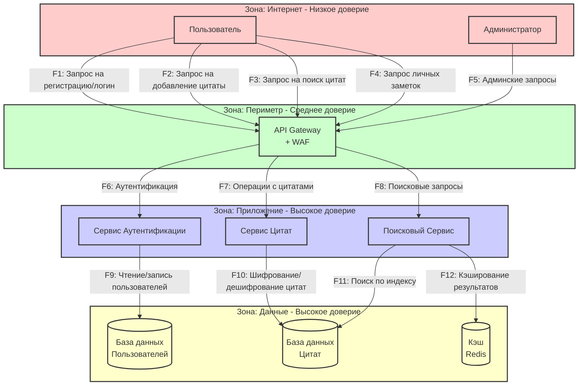
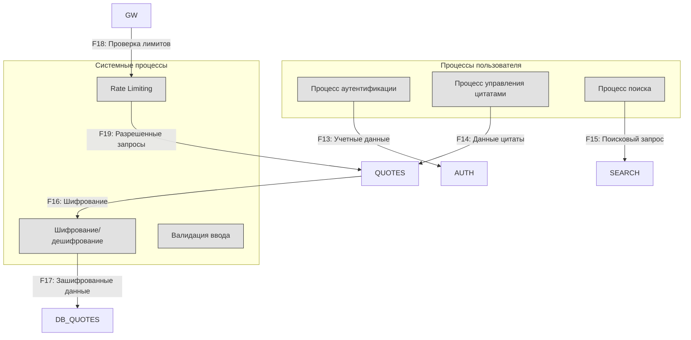

# Модель угроз: Диаграмма потоков данных (DFD)

## Контекстная диаграмма (Уровень 0)

```mermaid
graph TD
    subgraph Интернет [Зона: Интернет - Низкое доверие]
        USER[Пользователь]
        ADMIN[Администратор]
    end

    subgraph Периметр [Зона: Периметр - Среднее доверие]
        GW[API Gateway<br/>+ WAF]
    end

    subgraph Приложение [Зона: Приложение - Высокое доверие]
        AUTH[Сервис Аутентификации]
        QUOTES[Сервис Цитат]
        SEARCH[Поисковый Сервис]
    end

    subgraph Данные [Зона: Данные - Высокое доверие]
        DB_USERS[(База данных<br/>Пользователей)]
        DB_QUOTES[(База данных<br/>Цитат)]
        CACHE[(Кэш<br/>Redis)]
    end

    %% Потоки данных
    USER -- "F1: Запрос на регистрацию/логин" --> GW
    USER -- "F2: Запрос на добавление цитаты" --> GW
    USER -- "F3: Запрос на поиск цитат" --> GW
    USER -- "F4: Запрос личных заметок" --> GW

    ADMIN -- "F5: Админские запросы" --> GW

    GW -- "F6: Аутентификация" --> AUTH
    GW -- "F7: Операции с цитатами" --> QUOTES
    GW -- "F8: Поисковые запросы" --> SEARCH

    AUTH -- "F9: Чтение/запись пользователей" --> DB_USERS
    QUOTES -- "F10: Шифрование/дешифрование цитат" --> DB_QUOTES
    SEARCH -- "F11: Поиск по индексу" --> DB_QUOTES
    SEARCH -- "F12: Кэширование результатов" --> CACHE

    %% Границы доверия
    classDef internet fill:#ffcccc,stroke:#333,stroke-width:2px, color:#333;
    classDef perimeter fill:#ccffcc,stroke:#333,stroke-width:2px, color:#333;
    classDef application fill:#ccccff,stroke:#333,stroke-width:2px,color:#333;
    classDef data fill:#ffffcc,stroke:#333,stroke-width:2px, color:#333;

    class USER,ADMIN,Интернет internet;
    class GW,Периметр perimeter;
    class AUTH,QUOTES,SEARCH,Приложение application;
    class DB_USERS,DB_QUOTES,CACHE,Данные data;
```

```mermaid
graph TD
    subgraph Пользовательские_процессы [Процессы пользователя]
        P1[Процесс аутентификации]
        P2[Процесс управления цитатами]
        P3[Процесс поиска]
    end

    subgraph Системные_процессы [Системные процессы]
        P4[Шифрование/дешифрование]
        P5[Валидация ввода]
        P6[Rate Limiting]
    end

    P1 -- "F13: Учетные данные" --> AUTH
    P2 -- "F14: Данные цитаты" --> QUOTES
    P3 -- "F15: Поисковый запрос" --> SEARCH

    QUOTES -- "F16: Шифрование" --> P4
    P4 -- "F17: Зашифрованные данные" --> DB_QUOTES

    GW -- "F18: Проверка лимитов" --> P6
    P6 -- "F19: Разрешенные запросы" --> QUOTES

    classDef process fill:#e1e1e1,stroke:#333, ,stroke-width:1px, color:#333;
    class P1,P2,P3,P4,P5,P6 process;
```
